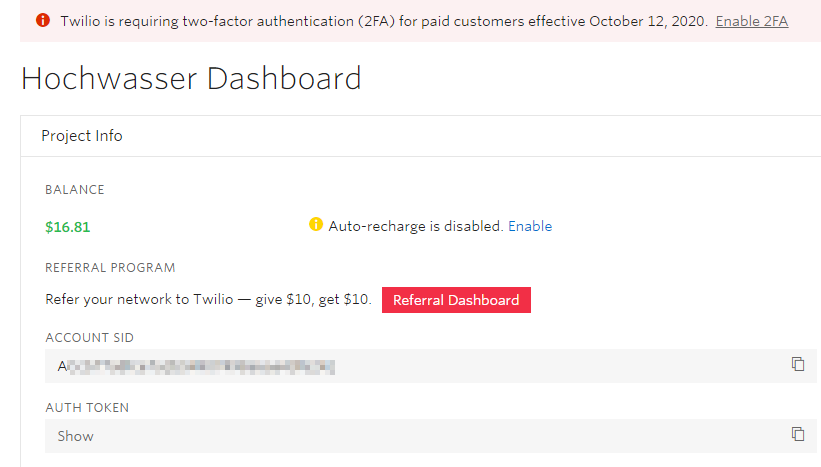

# Flooding alert
I Bult an Alarmsystem that Detects if the creek next to my house will owerflow soon. 
This gives me Time to react and Prevent a flooding of the Houses around me. 
 
## Instalation

To Install Twilio you need to run the folowing command.

```sh
pip install twilio
```

You allso need to install the [Python MySQL](https://www.w3schools.com/python/python_mysql_getstarted.asp) extention
```sh
python -m pip install mysql-connector-python
```

## Twilio

You need to create a Twilio account. 
On the Twilio Dashboard you can get all the Info ypu need. 



## Make it Work

To Make it Work you need to edit the folowing Parts in the ``alarm.py`` file:

```python
#Insert your Account SID from Twilio.com
account_sid = '***'
#Instert your auth_token from Twilio.com
auth_token = '***'
# Instert your Reciving Phone-Nr
phone_nr = '***'
#Inster your outbound Twilio Phone Number
twilio_nr='***'
```